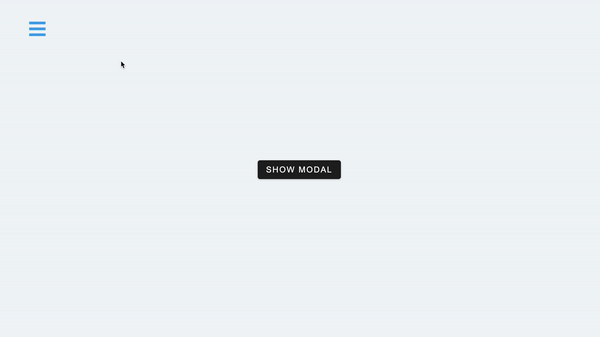

## Summary

`useContext()` to control open/close modal and sidebar

[Live Demo](https://christy313.github.io/react15-project12)



## File structure

```
.
└── src
    ├── App.js
    ├── components
    │   ├── Home.js
    │   ├── Modal.js
    │   └── Sidebar.js
    ├── context.js
    ├── data
    │   └── data.js
    ├── index.css
    ├── index.js
    └── logo.svg
```

## Available Scripts

In the project directory, you can run:

### `npm start`

Runs the app in the development mode.\
Open [http://localhost:3000](http://localhost:3000) to view it in your browser.